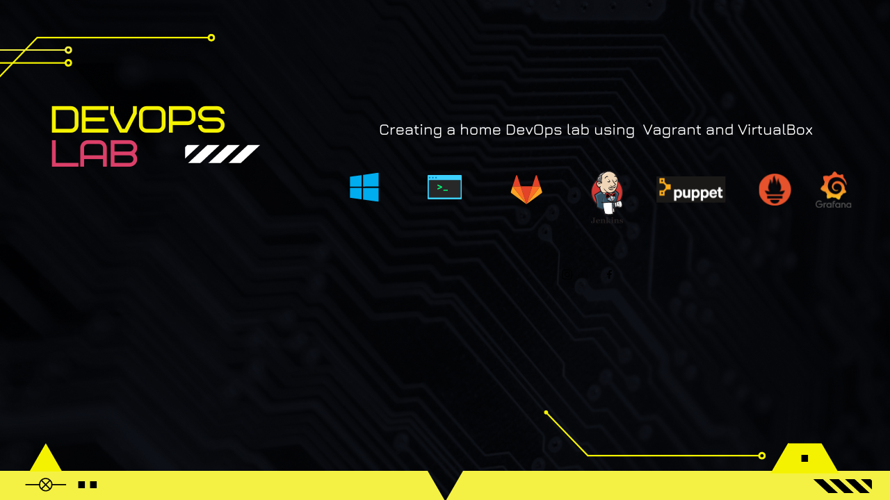
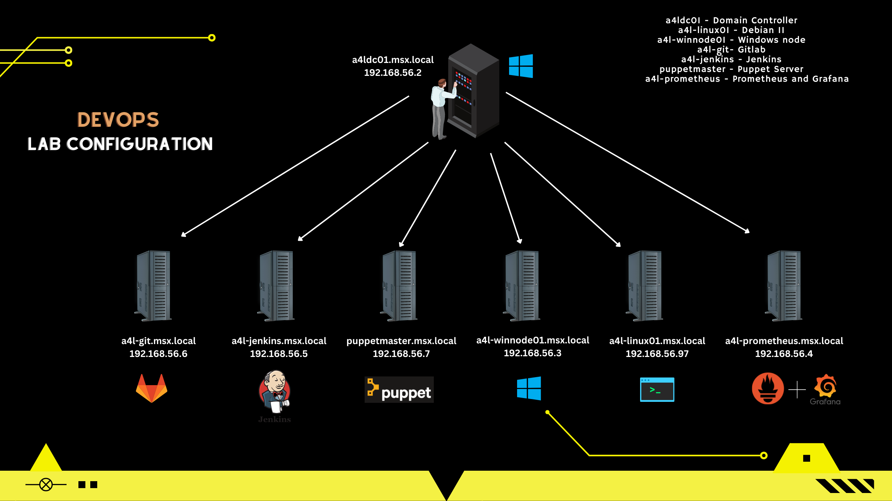

Getting started with a DevOps home lab is great. You can spin up, mess around and use it as playground for learning. Also while setting up a lab on your own you will encounter amy challenges and issues which willhelp you understand how all these tools are connected together. No need to have physical servers or cloud account which might charge extra money :). Here I am using my PC to build a small scale lab with all the mainstream DevOps tools.

**Minimum/Recommended System Requirements for the lab**
---

Atleast 8GB/16GB of memory

150GB of disk space

A processor equivalent to Intel's i5/i7

**Lab Configuration**
---

**Info**
---

First thing first we need to install Virtual Box and Vagrant on the PC/Laptop. These two things will spawn seven VMs for us. 

You need at least 1CPU core 1GB RAM per VMs for the VMs except for the Puppetmaster andthe gitlab server which will need more resources. The number of VMs can be reduced to four if you have limited resources.

1. One Microsoft Server 2019 Server which will act as an Active Directory Domain Controller node and also as a DNS server for our domain msx.local. 

2. A puppetserver node which will server as the puppetmaster for our lab infrastructure.

3. A gitlab server which will host our local repositiories

4. A jenkins server to implement CI/CD workflows, pipelines.

5. A prometheus and grafana server to monitor our lab infrastructure.

6. One windows and one linux server which can be used to setup a sql server or web servers.

**Lab Details**
---

1. All the hosts windows or linux are added to the domain msx.local as soon as you run vagrant up command for the host.

2. Puppet agent is installed on all the hosts, you just need to sign the certificates for the hosts by logging in to the puppetmaster.msx.local server

3. Node Exporter and windows exporter are installed on all the linux and windows hosts to fetch system metrics for prometheus.

4. All of the directories and sub-directories of the repositories are self-explanatory and hosts the respective VMs as the name of the directory indicates.

5. The data directory contains all the shell and powershell scripts used to bootstrap and provision the VMs.

6. The vagrant_scripts directory conatains simple scripts which can be used to run vagrant commands from anywhere, just modify your VM path accordingly. These scripts just 'cd' to the vagrant directory and run the commands, nothing fancy but comes in handy when you have many VMs. You will need to add this path to your PATH variable to be able to use them from anywhere.

**How to setup this lab on your own PC/Laptop?**
---

Install vagrant and virtualbox as mentioned at the start of this article.

Clone this github repository on your local PC/Laptop.

Start the Vms by using the provided scripts in vagrant_scripts or CD to the directory of the VMs and run vagrant up command

Start the VMs in the following order to avoid any connectivity issues.

1. Domain Controller

 
2. Puppet Master 

3. Prometheus Server 

4. Rest of the VMs

Domain name used for setting up the lab is msx.local. This can be changed by running the command against the scripts in the data directory

EXAMPLE:

sudo sed -i 's|msx|newdomain|g' add_to_domain.sh

sudo sed -i 's|MSX|NEWDOMAIN|g' add_to_domain.sh

The above command assumes that the new domain ends with .local suffix. Please modify the command accordingly incase you want to change the domain suffix. This command needs to be run for all the scripts present in data folder.

The default password used across the lab is msx@9797, for all AD users, admin passwords etc except for the default configs of gitlab, jenkins and grafana.

